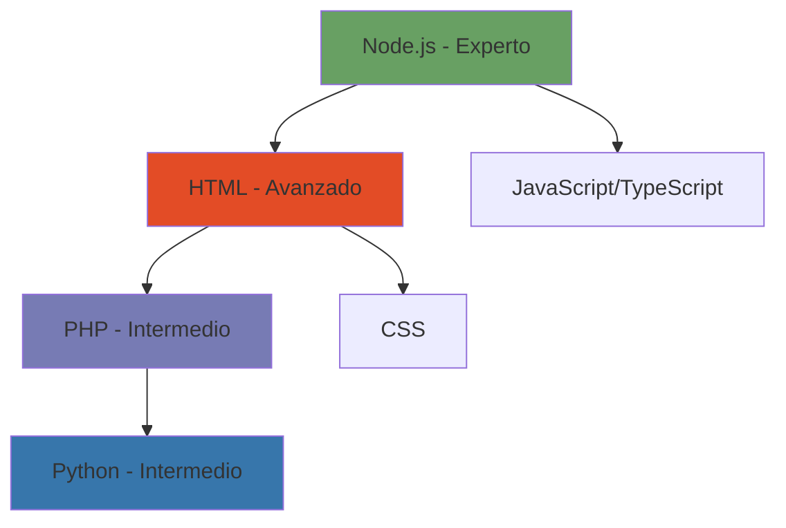

  
    
  
  <h2>👋 SoyMaycol - GitHub</h2>  
     
  
  
<strong>Desarrollador apasionado por crear Bots, sitios web y proyectos innovadores</strong>
  

  

   
     

  

---

## 🚀 Sobre Mí

Hola, soy **Maycol**, un desarrollador de 12 años nacido en Perú con una gran pasión por la programación. Mi viaje en el mundo del desarrollo comenzó de una forma muy especial y aquí te cuento mi historia.

### 📖 Mi Historia

Todo empezó en **2022-2023** gracias a **Friday Night Funkin'**. Ese juego cambió mi vida y me inspiró a crear mis propios mods usando **Psych Engine** y **Lua**. Formé un pequeño equipo y juntos creábamos mods increíbles. Era una época muy divertida.

En **2024**, mi número de WhatsApp fue baneado permanentemente y perdí todo lo que tenía ahí. Después de eso, me alejé un poco de la programación.

Un año después, mientras exploraba grupos random, descubrí un bot llamado **GataBotMD**. La curiosidad me llevó a investigarlo a fondo, y eso despertó en mí la idea de crear mi propio bot. En ese proceso conocí a alguien que con el tiempo se convirtió en mi mejor amigo: **Ado (Wirk)**.

Juntos hacíamos bots "chafas" pero funcionales, todo en **Termux**, sin saber qué era un host o una API. Con dedicación y práctica fuimos evolucionando. Descubrimos **GitHub** (aunque al principio compartíamos proyectos en .zip 😅), aprendimos sobre APIs y mejoramos nuestras habilidades día a día.

Conocimos a más personas increíbles como **Yosue** y **YosoyYo**, y formamos el **SYA Team**. Aunque en **2025** el equipo original se disolvió, lo retomé como mi comunidad personal con un nuevo enfoque.

Todo lo que viví fue una etapa increíble. Aprendí muchísimo, crecí como persona y como programador. Los recuerdos y la amistad con Ado siguen siendo muy importantes para mí. Sin duda, una de las mejores épocas que he tenido.

---

## 💻 Lenguajes y Tecnologías

Mi experiencia con diferentes lenguajes de programación:

### 🛠️ Habilidades Principales

- **Node.js**: Mi lenguaje principal, con el que he desarrollado la mayoría de mis bots y proyectos
- **HTML/CSS**: Creación de sitios web y interfaces de usuario
- **PHP**: Desarrollo backend y manejo de bases de datos
- **Python**: Automatización y scripts diversos
- **Git/GitHub**: Control de versiones y colaboración
- **APIs**: Integración y consumo de servicios externos

---

## 🎯 Proyectos Destacados

- 🤖 **Bots de WhatsApp**: Desarrollo de bots funcionales con múltiples características
- 🌐 **Sitios Web**: Creación de páginas web responsivas y modernas
- 🎮 **Mods de FNF**: Modificaciones personalizadas usando Psych Engine y Lua
- 🔧 **Herramientas y Utilidades**: Scripts y aplicaciones para diferentes propósitos

---

## 📬 Contacto

Siempre estoy interesado en nuevas oportunidades y proyectos interesantes. ¡Siéntete libre de comunicarte si deseas trabajar juntos!

📧 **Email**: soymaycol.cn@gmail.com  
💻 **GitHub**: [github.com/SoySapo6](https://github.com/SoySapo6)

---

  
  
  
<em>"Cada línea de código es un paso más hacia la innovación"</em>

  
  ⭐ ¡No olvides darle una estrella a mis proyectos si te gustan! ⭐

